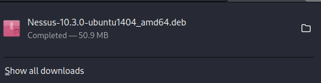

# Nessus Installation

# Downloading of Nessus:

- Visit
    
    [Download Nessus](https://www.tenable.com/downloads/nessus?loginAttempted=true)
    
- Download nessus as per your destro
    
    
    
    - I am using Kali Linux to demonstrate.

# Installation and Running of Nessus:

- Installation:
    
    ```powershell
    dpkg -i Nessus-10.3.0-ubuntu1404_amd64.deb
    ```
    
    
    
- Running the Service:
    
    ```powershell
    systemctl start nessusd.service
    ```
    
- Running:
    - Visit:
        
        ```powershell
        https://localhost:8834/#/
        ```
        
        
        

# Configuring Nessus:

- Choose free version:
    
    
    
- Enter details:
    
    
    
    - get temprory mail id from: [https://temp-mail.org/en/](https://temp-mail.org/en/)
- Enter Activation Key:
    
    
    
- Set Username and Password:
    
    
    
- It will download all neccessary plugins:
    
    
    
- Dashboard Access:
    
    
    

# Running Nessus on Vulnerable Web Application:

- I am Using DVWA as my vulnerable web application
- Using docker image of DVWA: [https://hub.docker.com/r/sagikazarmark/dvwa](https://hub.docker.com/r/sagikazarmark/dvwa)
- My docker image is running on: [http://172.17.0.2](http://172.17.0.2/)

## Setup of Nessus for Scan:

- New scan
    
    
    
- Web Application tests
    
    
    
- Running DVWA docker image:
    
    
    
- Set Nessus for the scanning:
    
    
    
    
    
    
    
- Launch the Scan
    
    
    
- See in the logs that our scanner in scanning the Application:
    
    
    
    
    
    
    

## SCAN COMPLETED AND FOUND ALL THE BASIC VULNERABILITIES YOU CAN CONFIGURE AS PER YOUR NEEDS

## Contributor:

- [princep4 - Github](https://github.com/princep4)

- [PrincePrafull3 -  Twitter](https://twitter.com/PrincePrafull3)

- [Prince Prafull - Linkedin](https://www.linkedin.com/in/prince-prafull-19a477194/)
